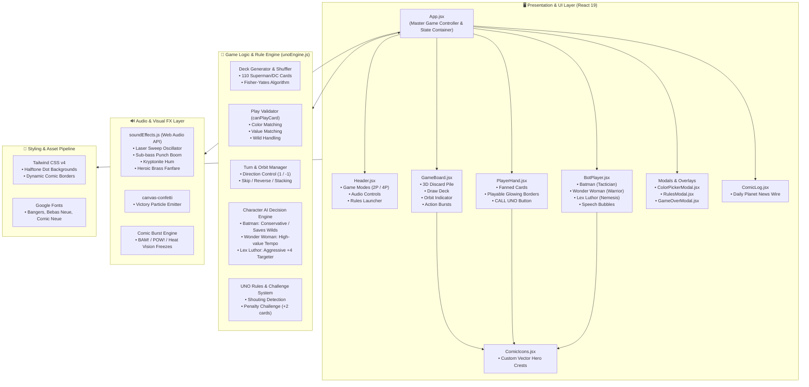
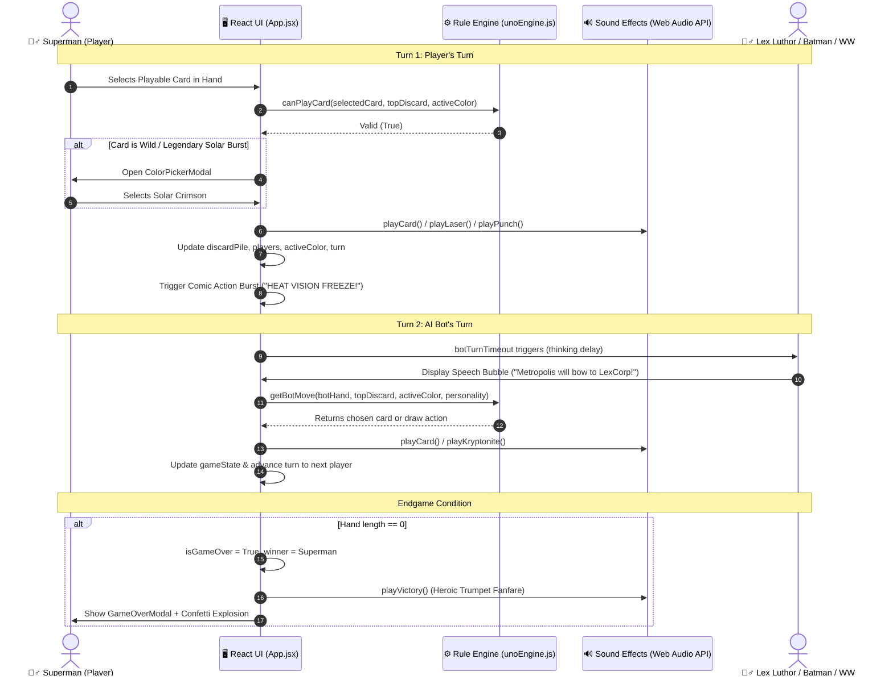
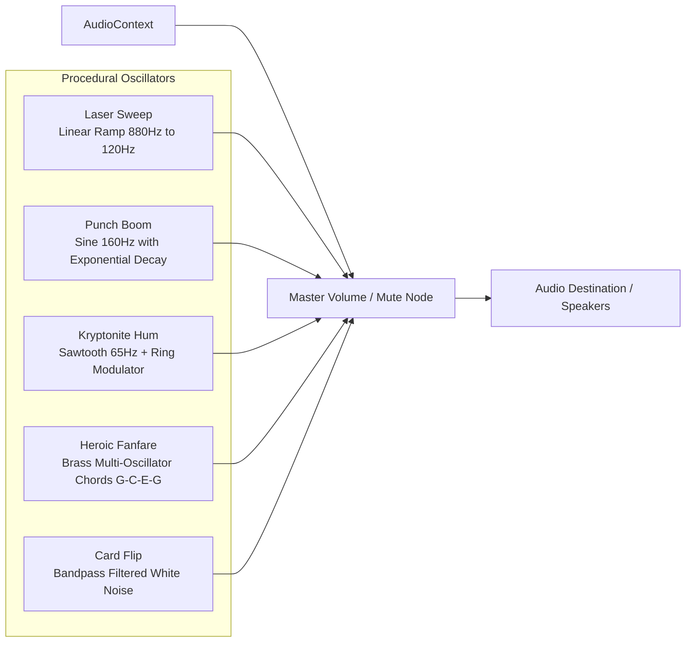

# 🏛️ Software Architecture: Superman & DC Comics UNO (Battle for Metropolis)

This document provides a comprehensive technical overview of the architecture, design patterns, state management, and component hierarchies for the **Superman & DC Comics UNO** web application.

---

## 1. High-Level System Architecture



---

## 2. Game Loop & State Flow Diagram

The state transitions follow a unidirectional data flow coordinated entirely through immutable state updates in `App.jsx`:



---

## 3. Component Hierarchy & Responsibilities

| Component | Responsibility |
| :--- | :--- |
| **`App.jsx`** | Central container. Owns `game` state, orchestrates AI timeouts, handles color picker modals, dispatches sound effects, and runs turn transitions. |
| **`Header.jsx`** | Top bar. Houses the 3D Superman title badge, mode switcher (2P Duel vs. 4P League), sound mute toggle, and rules launcher. |
| **`GameBoard.jsx`** | Center arena. Displays 3D-angled draw deck with card counters, rotating discard stack, orbital direction ring, and comic action popups. |
| **`PlayerHand.jsx`** | Bottom shelf. Renders Superman's interactive fanned card hand, glow animations on legal cards, "CALL UNO!" button, and challenge button. |
| **`BotPlayer.jsx`** | Surrounding opponent stations (Batman, Wonder Woman, Lex Luthor). Displays 3D face-down card stacks, character crests, and dynamic dialogue bubbles. |
| **`CardView.jsx`** | Reusable card renderer. Generates front and back faces, corner values, custom SVG comic emblems, halftone patterns, and hover physics. |
| **`ColorPickerModal.jsx`** | 4-quadrant comic modal for choosing new color frequency (Solar Crimson, Metropolis Azure, Solar Gold, Kryptonite Emerald). |
| **`GameOverModal.jsx`** | Victory/Defeat screen rendering match statistics, hero dialogue, and trigger for `canvas-confetti`. |
| **`RulesModal.jsx`** | Illustrated Hero's Field Manual detailing standard UNO mechanics and custom DC action card powers. |
| **`ComicLog.jsx`** | Collapsible Daily Planet News Wire logging every move, penalty, skip, and villain shout. |

---

## 4. Game Logic & AI Decision Engine (`unoEngine.js`)

### Tactical AI Personalities
Each AI opponent evaluates the board and picks cards based on custom superhero tactical weighting:

- **🦇 Batman (The Dark Knight)**:
  - Conserves Wild and +4 cards for defensive emergencies.
  - Prioritizes attacking the player who currently has the fewest cards in hand.
- **👸 Wonder Woman (Princess of Themyscira)**:
  - Balances high-value tempo plays.
  - Matches colors aggressively to deplete standard number cards first.
- **🧪 Lex Luthor (LexCorp Mastermind)**:
  - Aggressive nemesis.
  - Prioritizes playing Kryptonite Ambush (+4) and Super Punch (+2) cards against Superman whenever possible.

---

## 5. Procedural Audio Synthesis Architecture (`soundEffects.js`)

Unlike traditional web games that load external MP3/WAV files over HTTP, this application generates **100% of its sound effects procedurally** using the browser's native **Web Audio API**:



---

## 6. Directory Structure

```text
superman-uno/
├── media/                     # Demo video and high-res screenshot assets
│   ├── superman_uno_demo.mp4
│   ├── superman_uno_screenshot2.png
│   ├── test_duel_mode.png
│   └── test_rules_modal.png
├── public/                    # Static favicon and vector symbols
│   ├── favicon.svg
│   └── icons.svg
├── src/
│   ├── assets/                # Logos and icons
│   ├── audio/                 # Web Audio API sound synthesizer
│   │   └── soundEffects.js
│   ├── components/            # UI components
│   │   ├── BotPlayer.jsx
│   │   ├── CardView.jsx
│   │   ├── ColorPickerModal.jsx
│   │   ├── ComicIcons.jsx
│   │   ├── ComicLog.jsx
│   │   ├── GameBoard.jsx
│   │   ├── GameOverModal.jsx
│   │   ├── Header.jsx
│   │   ├── PlayerHand.jsx
│   │   └── RulesModal.jsx
│   ├── logic/                 # Pure game engine & AI tactics
│   │   └── unoEngine.js
│   ├── App.jsx                # Main orchestrator component
│   ├── index.css              # Comic styles & Tailwind configuration
│   └── main.jsx               # Application entry point
├── ARCHITECTURE.md            # System architecture specification
├── README.md                  # Project overview & quickstart guide
├── package.json               # Dependencies and scripts
└── vite.config.js             # Vite configuration with Tailwind CSS
```
