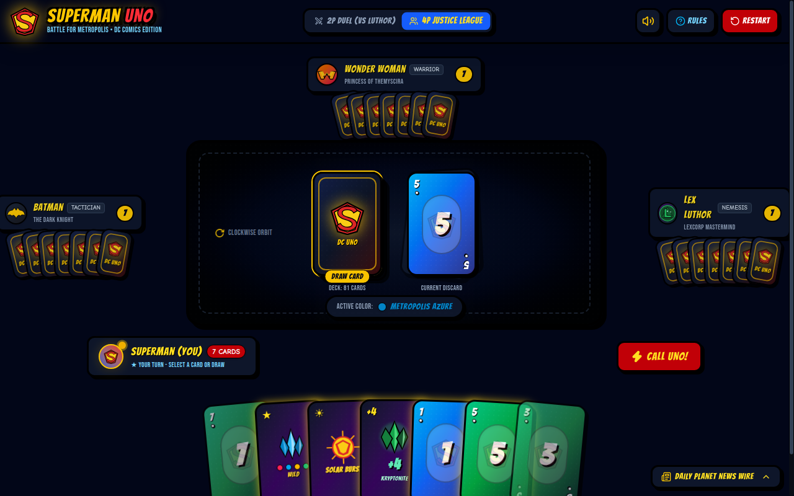

# 🦸‍♂️ Superman UNO: Battle for Metropolis (DC Comics Edition)

An authentic, comic-book-styled **UNO card game** built with **React**, **Vite**, and **Tailwind CSS**. Play as **Superman (The Man of Steel)** battling against iconic DC Comics characters—**Batman**, **Wonder Woman**, and his arch-nemesis **Lex Luthor**.



---

## ⚡ Features

- **Iconic DC Comics Theme**:
  - **Superman (Kal-El)** with the legendary red/gold 'S' Shield.
  - Opponents with distinct AI personalities:
    - **Batman (The Dark Knight)**: Defensive tactician.
    - **Wonder Woman (Princess of Themyscira)**: Balanced warrior.
    - **Lex Luthor (LexCorp Nemesis)**: Aggressive attacker who targets Superman with Kryptonite.
- **Custom Superhero Action Cards**:
  - 🔥 **Heat Vision Blast (Skip)**: Stuns the target with ruby laser beams.
  - 🔄 **Vortex Rewind (Reverse)**: Superman circles the globe, reversing play order.
  - 💥 **Super Punch (+2)**: Comic hit "POW!" forcing the next player to draw 2 cards.
  - ❄️ **Fortress Spectrum (Wild)**: Harnesses crystalline matrix energy to shift the color.
  - ☢️ **Kryptonite Ambush (+4)**: LexCorp radioactive attack forcing target to draw 4 cards.
  - ☀️ **Solar Burst (Legendary Special)**: Exclusive Superman card that sets the color and forces all opponents to draw 1 card.
- **4 Solar Color Frequencies**:
  - 🔴 **Solar Crimson** (Superman's Cape)
  - 🔵 **Metropolis Azure** (Man of Steel Suit)
  - 🟡 **Solar Gold** (Yellow Sun Power)
  - 🟢 **Kryptonite Emerald** (Radioactive Hazard)
- **Web Audio API Superhero Sound Synthesizer**:
  - 100% procedural synthetic sound effects (lasers, comic punch impacts, radiation hum, vortex swoosh, and victory fanfare) with zero external audio assets.
- **2 Game Modes**:
  - **4P Justice League Table**: Superman vs. Batman, Wonder Woman, and Lex Luthor.
  - **2P Metropolis Duel**: 1-on-1 clash between Superman and Lex Luthor.
- **Dynamic Comic Bursts & Shouting UNO**:
  - Action callouts (*"BAM!"*, *"HEAT VISION FREEZE!"*, *"UP, UP & AWAY! UNO CALLED!"*).
  - Challenge feature to catch opponents who forget to call UNO for a +2 penalty!
- **Daily Planet News Wire**: Live comic chronicle tracking all game turns and villain taunts.

---

## 🎮 Gameplay Demo

A 24-second gameplay demo video showcasing all features:

- Video file: [`media/superman_uno_demo.mp4`](media/superman_uno_demo.mp4)

---

## 🚀 Getting Started

### Prerequisites
- Node.js (v18 or higher recommended)
- npm or yarn / pnpm

### Installation

```bash
# Clone the repository
git clone <your-repository-url>
cd superman-uno

# Install dependencies
npm install

# Start the Vite development server
npm run dev
```

Open your browser and navigate to `http://localhost:5173`.

### Production Build

```bash
npm run build
npm run preview
```

---

## 🛠️ Tech Stack

- **Frontend Framework**: React 19 + Vite
- **Styling**: Tailwind CSS + custom comic halftone & border styling
- **Icons**: Lucide React + custom inline DC superhero vector SVGs
- **Celebration Effects**: Canvas Confetti
- **Audio**: Web Audio API (procedural oscillator synthesizer)

---

## 📜 License

Created for educational and demo purposes. Superman and DC Comics characters, names, and related indicia are trademarks of DC Comics and Warner Bros. Discovery.
