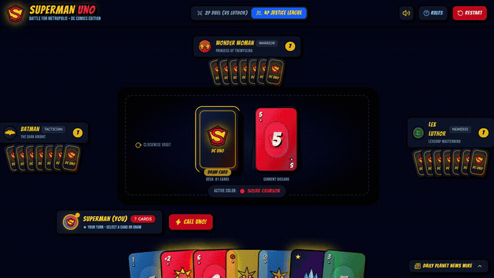
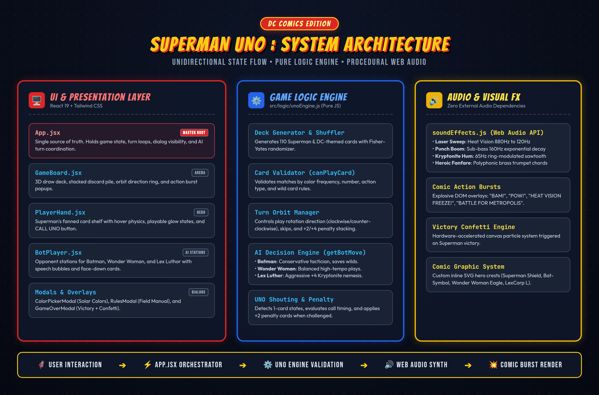

# 🦸‍♂️ Superman UNO: Battle for Metropolis (DC Comics Edition)

An authentic, comic-book-styled **UNO card game** built with **React**, **Vite**, and **Tailwind CSS**. Play as **Superman (The Man of Steel)** battling against iconic DC Comics characters—**Batman**, **Wonder Woman**, and his arch-nemesis **Lex Luthor**.


---

## ⚡ Features

- **Iconic DC Comics Theme**:
  - **Superman (Kal-El)** with the legendary red/gold 'S' Shield.
  - Opponents with distinct AI personalities:
    - **Batman (The Dark Knight)**: Defensive tactician.
    - **Wonder Woman (Princess of Themyscira)**: Balanced warrior.
    - **Lex Luthor (LexCorp Nemesis)**: Aggressive attacker who targets Superman with Kryptonite.
- **Custom Superhero Action Cards**:
  - 🔥 **Heat Vision Blast (Skip)**: Stuns the target with ruby laser beams.
  - 🔄 **Vortex Rewind (Reverse)**: Superman circles the globe, reversing play order.
  - 💥 **Super Punch (+2)**: Comic hit "POW!" forcing the next player to draw 2 cards.
  - ❄️ **Fortress Spectrum (Wild)**: Harnesses crystalline matrix energy to shift the color.
  - ☢️ **Kryptonite Ambush (+4)**: LexCorp radioactive attack forcing target to draw 4 cards.
  - ☀️ **Solar Burst (Legendary Special)**: Exclusive Superman card that sets the color and forces all opponents to draw 1 card.
- **4 Solar Color Frequencies**:
  - 🔴 **Solar Crimson** (Superman's Cape)
  - 🔵 **Metropolis Azure** (Man of Steel Suit)
  - 🟡 **Solar Gold** (Yellow Sun Power)
  - 🟢 **Kryptonite Emerald** (Radioactive Hazard)
- **Web Audio API Superhero Sound Synthesizer**:
  - 100% procedural synthetic sound effects (lasers, comic punch impacts, radiation hum, vortex swoosh, and victory fanfare) with zero external audio assets.
- **2 Game Modes**:
  - **4P Justice League Table**: Superman vs. Batman, Wonder Woman, and Lex Luthor.
  - **2P Metropolis Duel**: 1-on-1 clash between Superman and Lex Luthor.
- **Dynamic Comic Bursts & Shouting UNO**:
  - Action callouts (*"BAM!"*, *"HEAT VISION FREEZE!"*, *"UP, UP & AWAY! UNO CALLED!"*).
  - Challenge feature to catch opponents who forget to call UNO for a +2 penalty!
- **Daily Planet News Wire**: Live comic chronicle tracking all game turns and villain taunts.

---

## 🎮 Gameplay Demo

Watch the 24-second live gameplay demo:



- 🎥 **Full HD MP4 Video with Audio**: [Watch / Download `superman_uno_demo.mp4`](https://github.com/phanisyamresearch-tech/supermanuno/raw/main/media/superman_uno_demo.mp4)
- 📁 **Repository File**: [`media/superman_uno_demo.mp4`](media/superman_uno_demo.mp4)

---

## 🏛️ System Architecture



For complete technical specifications, component hierarchies, state flow diagrams, and procedural audio synthesis pipelines, see the [Architecture Documentation](ARCHITECTURE.md).

---

## 📖 How to Play (Game Instructions)

The goal is to defeat the villains and be the first player to empty your hand of cards!

### 1. Basic Rules
- **Matching Cards**: On your turn, play a card that matches the **Color** (*Solar Crimson, Metropolis Azure, Solar Gold, Kryptonite Emerald*) or **Number / Symbol** of the current card on top of the Discard Pile.
- **Wild Cards**: Wild cards (`Fortress Spectrum`, `Kryptonite Ambush +4`, and `Solar Burst`) can be played on any turn. When played, pick a new active color.
- **Drawing Cards**: If you don't have a playable card, click the **Draw Deck** to draw a card.

### 2. Calling UNO ("Up, Up & Away!")
- **When You Have 1 Card Left**: Immediately click the flaming **"⚡ CALL UNO!"** button before ending your turn.
- **Catching Opponents**: If an AI opponent fails to call UNO when they hold only 1 card, click the **"🚨 CATCH OPPONENT UNO!"** button to penalize them with **+2 penalty cards**!

### 3. Action Cards Guide
- 🔥 **Heat Vision Blast (Skip)**: Stuns the next player and skips their turn. In 2-Player Duel, gives you an immediate extra turn!
- 🔄 **Vortex Rewind (Reverse)**: Reverses the direction of play orbit (Clockwise ⇄ Counter-Clockwise).
- 💥 **Super Punch (+2)**: Forces the next player to draw 2 cards and forfeits their turn.
- ❄️ **Fortress Spectrum (Wild)**: Changes the active color to any frequency of your choice.
- ☢️ **Kryptonite Ambush (+4)**: Shifts color and forces the next player to draw 4 cards and skip their turn.
- ☀️ **Solar Burst (Superman Exclusive)**: Changes active color and forces **all opponents** to draw 1 card each!

---

## 🚀 Getting Started (Run Locally)

### Prerequisites
- [Node.js](https://nodejs.org/) (v18 or higher recommended)
- `git`

### Quick Start Instructions

```bash
# 1. Clone the repository
git clone https://github.com/phanisyamresearch-tech/supermanuno.git
cd supermanuno

# 2. Install dependencies
npm install

# 3. Start the local development server
npm run dev
```

Open your browser and navigate to:
👉 **`http://localhost:5173`**

### Production Build

```bash
# Build optimized production bundle
npm run build

# Preview production build locally
npm run preview
```

---

## 🛠️ Tech Stack

- **Frontend Framework**: React 19 + Vite
- **Styling**: Tailwind CSS + custom comic halftone & border styling
- **Icons**: Lucide React + custom inline DC superhero vector SVGs
- **Celebration Effects**: Canvas Confetti
- **Audio**: Web Audio API (procedural oscillator synthesizer)

---

## 📜 License

Created for educational and demo purposes. Superman and DC Comics characters, names, and related indicia are trademarks of DC Comics and Warner Bros. Discovery.
